<!-- ABOUT THE PROJECT -->
## LINUX FUNDAMENTALS

### Objective

For this project, the following steps were taken to demonstrate linux fundamentals:

- [LINUX FUNDAMENTALS](#linux-fundamentals)
  - [Objective](#objective)
    - [Creation of AWS Account](#creation-of-aws-account)
    - [Virtual Server(Instance) Creation](#virtual-serverinstance-creation)
    - [Connecting to the Server](#connecting-to-the-server)
    - [Software Management](#software-management)
      - [Installing A Software](#installing-a-software)
      - [Updating A Software](#updating-a-software)
      - [Removing A Software](#removing-a-software)

----

#### Creation of AWS Account

Register for a new AWS account and sign in.

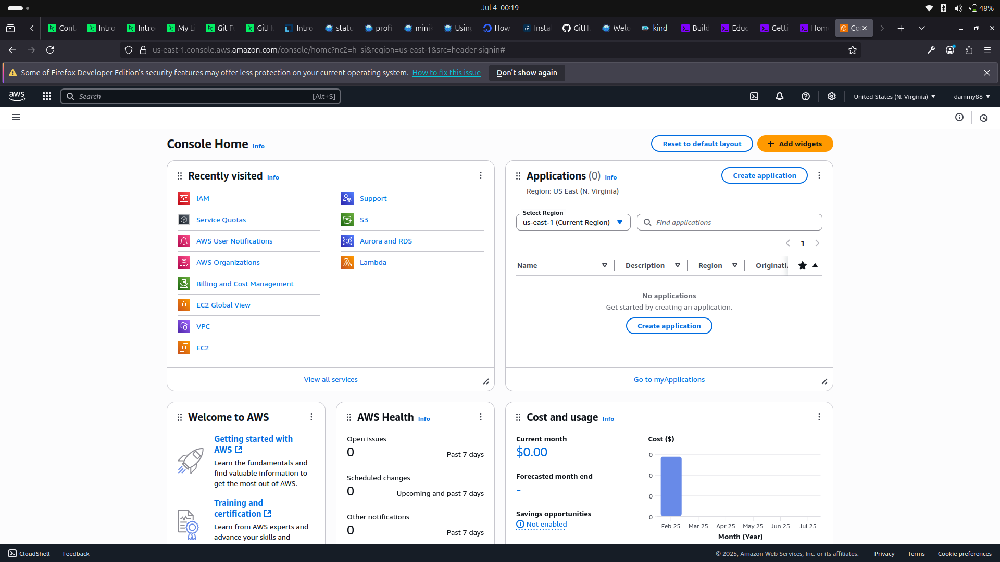

----

#### Virtual Server(Instance) Creation

Navigate to EC2 home and select Instances.
On the Instances page click on the Launch Instance button.
Fill the required text fields, generate an access key and select options eligible applicable to free tier. Afterwards, launch the instance.

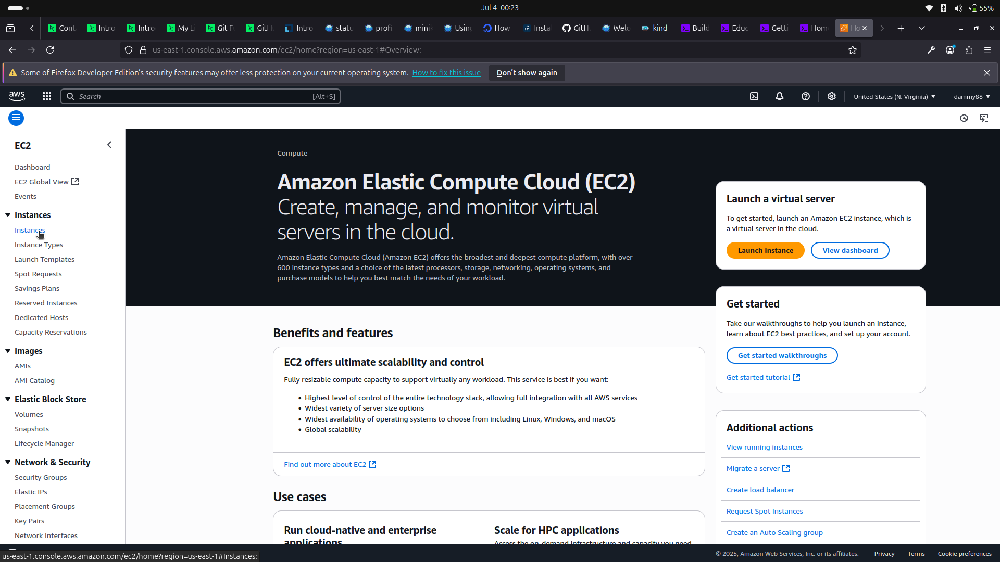

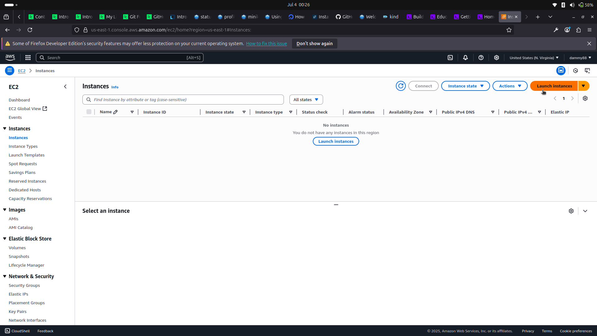

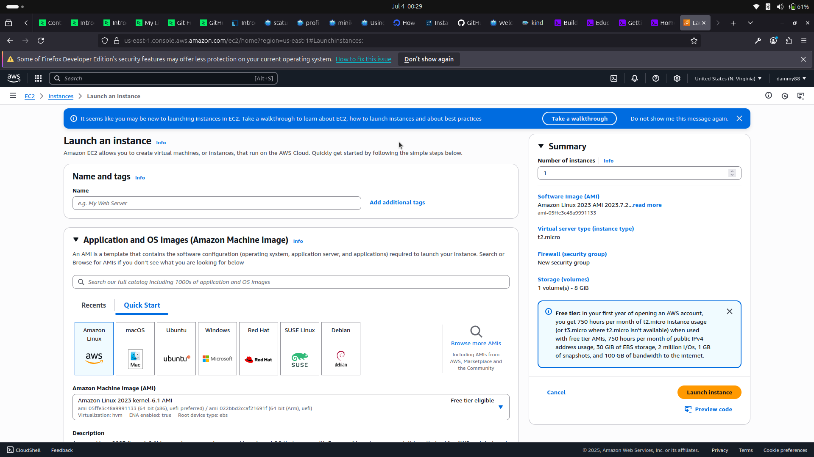

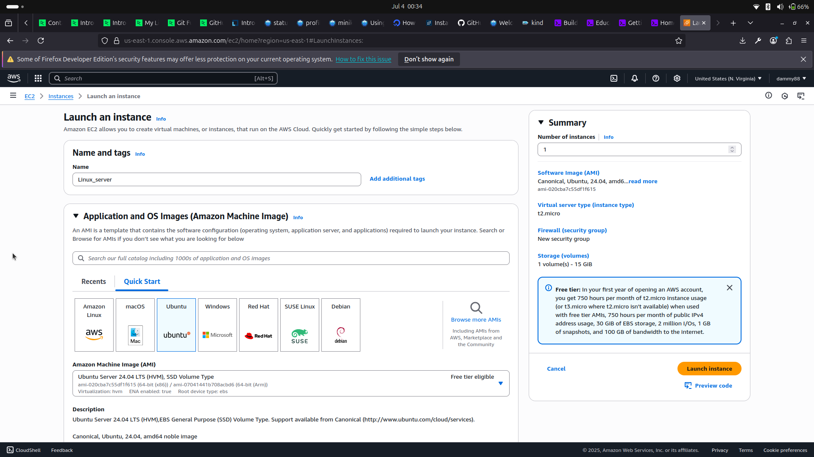

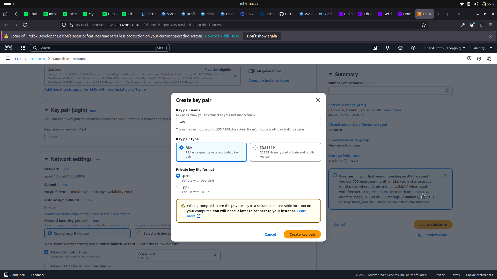

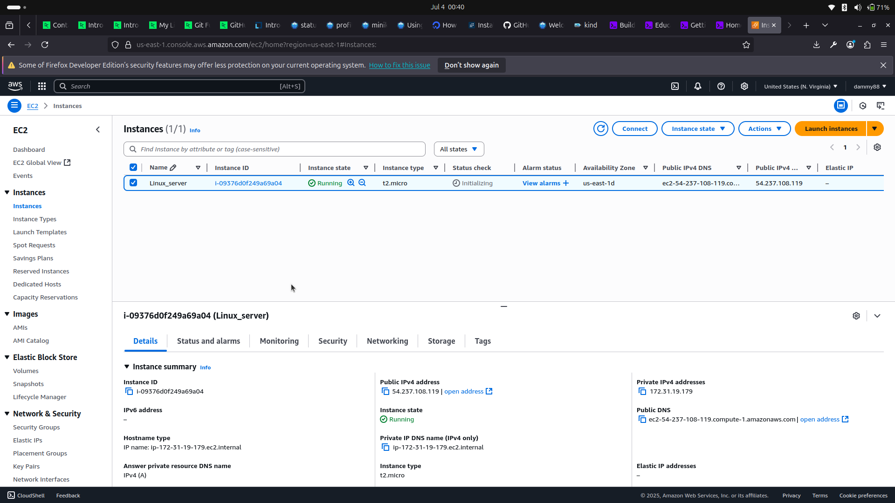

----

#### Connecting to the Server

Open your terminal.
Run the command chmod 400 "key.pem" to make the key private
Using the ssh command and pem file (key) access the new instance on its ip address.

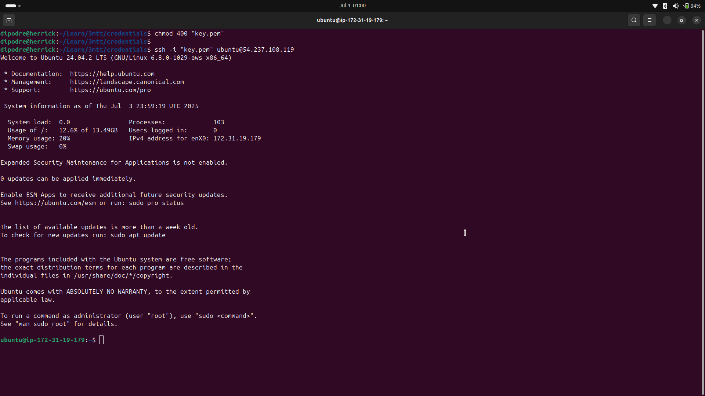

----

#### Software Management

Software can be installed, updated and removed with the help of a package manager.

##### Installing A Software

Refresh the package lists by running the command "sudo apt update"
Install a software by running the command "sudo apt install [software-name]"

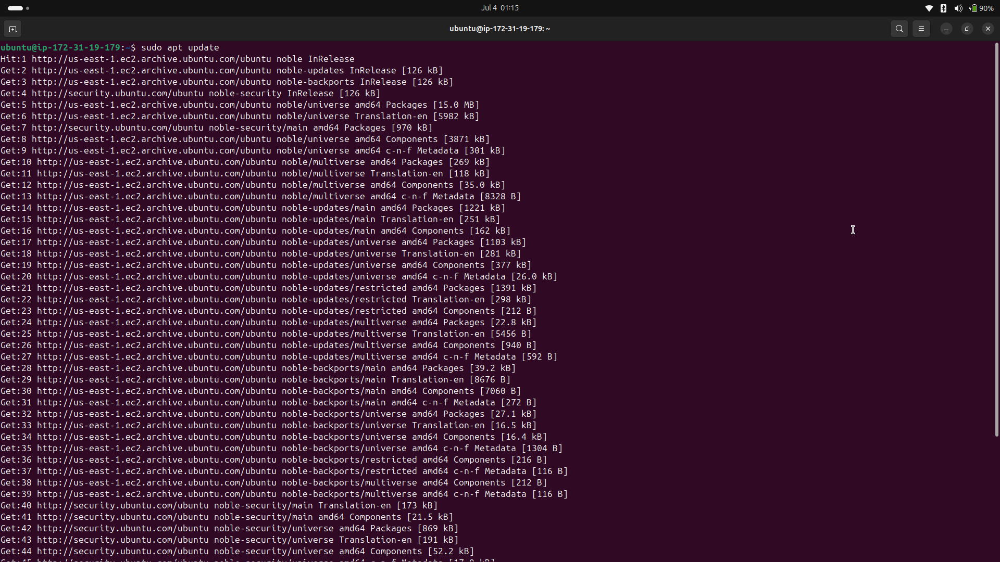

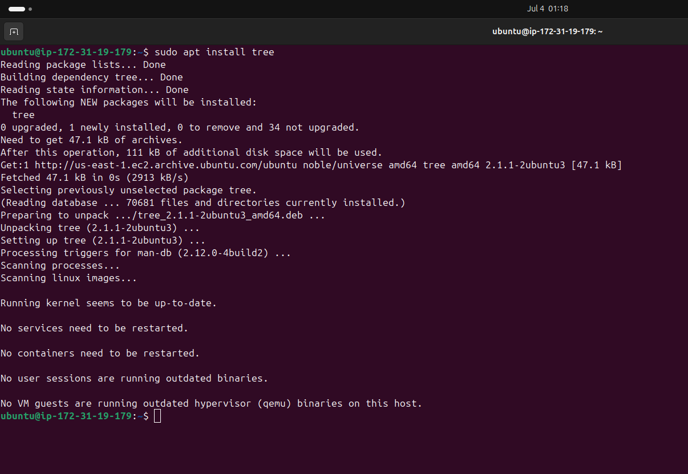

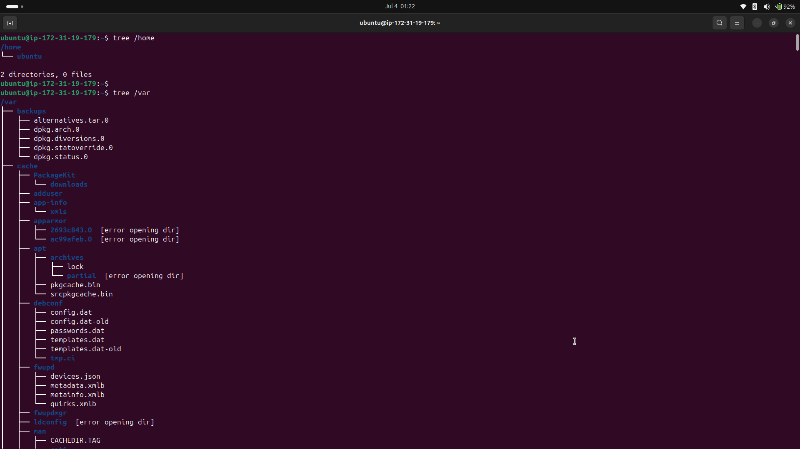

----

##### Updating A Software

Keep the system up-to-date by running the command "sudo apt upgrade"

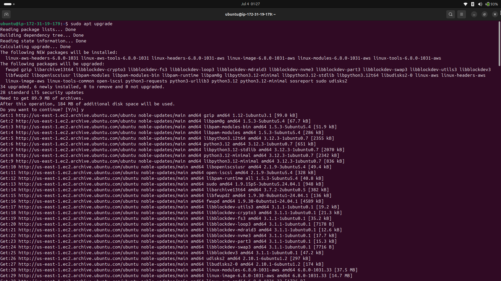

----

##### Removing A Software

A software can be removed by running the command "sudo apt remove [software-name]"

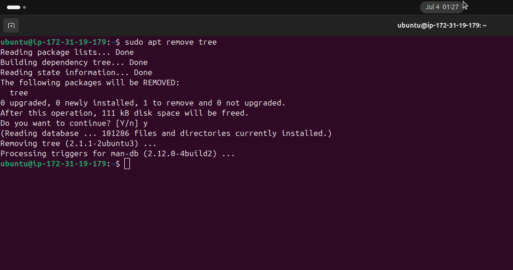

